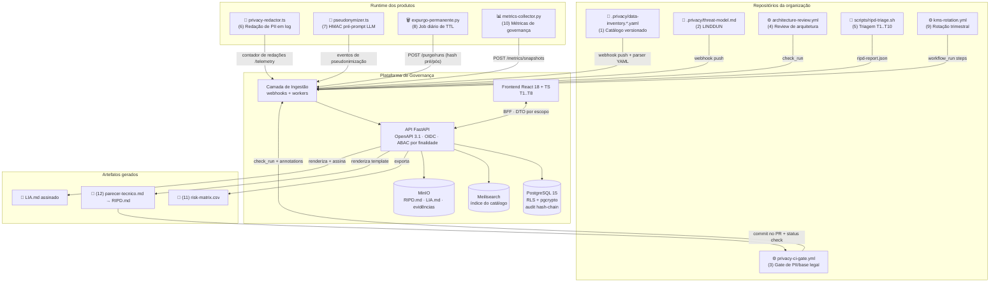
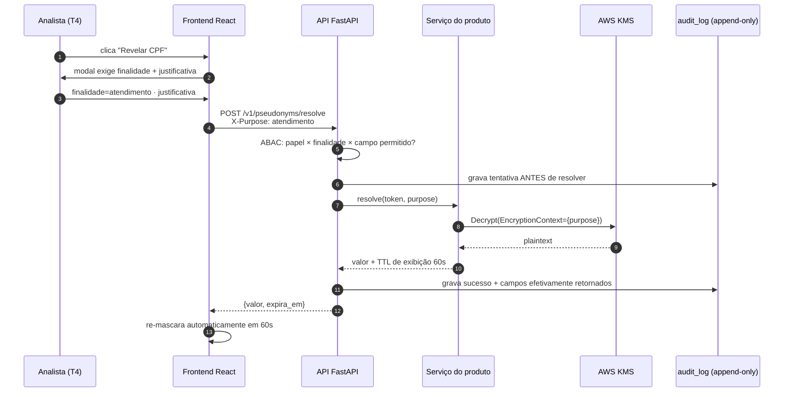
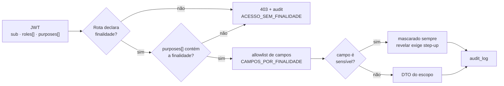

# Arquitetura — Plataforma de Governança de Privacidade (LGPD)

> Sistema que **operacionaliza** os 12 artefatos de privacidade já definidos (catálogo, LINDDUN,
> gates de CI/CD, triagem de RIPD, redator de PII, pseudonimizador, expurgo, rotação de KMS,
> coletor de métricas, matriz de risco, parecer técnico, LIA) em uma interface única para
> **engenharia, DPO e produto**.

---

## 1. Visão geral

**Princípio de fronteira:** a plataforma **não é fonte da verdade dos dados pessoais**. Ela guarda
*metadados de governança* (quem, para quê, por quanto tempo, com qual base legal) e *evidências*
(hashes, versões, aprovações). Dado pessoal de titular só transita nas telas T4 (Portal de Direitos)
e sempre pseudonimizado ou mascarado — a plataforma chama o serviço do produto, não replica a base.

---

## 2. Como cada um dos 12 artefatos se conecta via API

| # | Artefato | Direção | Contrato | Tela |
|---|---|---|---|---|
| 1 | `.privacy/data-inventory.*.yaml` | repo → plataforma | `POST /v1/catalog/inventories` (webhook `push`) + `POST /v1/catalog/inventories:validate` (upload manual, retorna diff) | **T2** |
| 2 | `.privacy/threat-model.md` | ↔ | `GET/PUT /v1/threat-models/{repo}` — parser do bloco mermaid + tabela LINDDUN | **T3** |
| 3 | `privacy-ci-gate.yml` | CI → plataforma | `POST /v1/gates/runs` com `check_run` + anotações; plataforma devolve `GET /v1/gates/runs/{id}/explain` (mensagem amigável) | **T1** |
| 4 | `architecture-review.yml` | CI ↔ plataforma | `POST /v1/gates/runs`; bloqueio liberado por `POST /v1/ripds/{id}/approve` (DPO) que reposta o status check | **T1**, **T3** |
| 5 | `scripts/ripd-triage.sh` | CI → plataforma | `POST /v1/ripds/triage` com `ripd-report.json` (`triggers_acionados[]`, `bloquear_merge`) | **T3** |
| 6 | `privacy-redactor.ts` | runtime → plataforma | `POST /v1/telemetry/redaction` (contadores agregados, **nunca** o valor redigido) → métrica *% serviços com log sem PII* | **T1**, **T6** |
| 7 | `pseudonymizer.ts` | plataforma → runtime | `POST /v1/pseudonyms/resolve` — reidentificação exige `X-Purpose` + justificativa; toda chamada vira linha no audit trail | **T4**, **T7** |
| 8 | `expurgo-permanente.py` | job → plataforma | `POST /v1/purge/runs` (tabela, contagem, `hash_pre`, `hash_pos`) e `POST /v1/purge/runs/{id}/verify` | **T6** |
| 9 | `kms-rotation.yml` | workflow → plataforma | `POST /v1/kms/rotations/{id}/steps` (gerar → canary → recriptografar → revogar) + `GET /v1/kms/keys` | **T7** |
| 10 | `metrics-collector.py` | job → plataforma | `POST /v1/metrics/snapshots` (payload de `docs/metrics/latest.json`) → séries em `metric_snapshots` | **T1** |
| 11 | `docs/risk-matrix.csv` | ↔ | `GET /v1/risks` · `PATCH /v1/risks/{id}` (exige `justificativa` na reclassificação) · `GET /v1/risks.csv` (round-trip com o CSV versionado) | **T5** |
| 12 | `templates/parecer-tecnico.md` | plataforma → repo | `POST /v1/ripds/{id}/render` → `RIPD.md` commitado no PR via App do GitHub | **T3** |
| + | LIA | plataforma → repo | `POST /v1/lias/{id}/render` → `LIA.md` com timestamp, hash e assinatura do DPO | **T8** |

---

## 3. Fluxo de dados de uma requisição sensível

Regras que a arquitetura impõe (não são convenção de tela):

- **404, nunca 403**, para recurso de titular fora do escopo do ator — sem oráculo de existência.
- **DTO por escopo** (`publico` / `atendimento` / `interno`) — nenhuma entidade ORM é serializada direta.
- **`totalItems` omitido** para papéis não-*trusted* (anti-enumeração); paginação por cursor.
- **`X-Purpose` obrigatório** em toda rota que toca dado de titular; ausência → 403 + linha de auditoria.
- **Toda leitura de PII grava antes de responder** — se o log falhar, a resposta falha.

---

## 4. Componentes e responsabilidades

| Camada | Tecnologia | Responsabilidade | Controle de privacidade embutido |
|---|---|---|---|
| Frontend | React 18 + TS, Material UI, Mermaid.js, React Flow | T1..T8 | Mascaramento por padrão, toggles `false`, re-mascaramento por TTL, `data-hj-suppress` nas áreas de titular |
| BFF/API | FastAPI + Python 3.12, Pydantic v2 | Orquestração, DTO por escopo, ABAC por finalidade | `X-Purpose`, allowlist de campos por finalidade, rate limit por ator |
| Ingestão | Workers (arq/Celery) + webhooks GitHub | Parser de YAML/JSON/markdown dos 12 artefatos | Rejeita payload com PII bruta (regex de CPF/e-mail no corpo) |
| Persistência | PostgreSQL 15, RLS + pgcrypto | Catálogo, RIPD, riscos, LIA, direitos, expurgo, KMS, auditoria | RLS por `tenant_id`; `audit_log` append-only com hash encadeado |
| Busca | Meilisearch | Filtros do catálogo (base legal, sensível, transferência, retenção) | Índice sem valores de dado — apenas metadados de campo |
| Objetos | MinIO (S3) | `RIPD.md`, `LIA.md`, evidências, relatórios de expurgo | SSE-KMS, links assinados com expiração de 24h |
| Chaves | AWS KMS | DEK por registro, KEK por finalidade | `EncryptionContext={purpose}`; CloudTrail espelhado em `kms_key_access_log` |
| Identidade | Keycloak/Auth0 (OIDC) | Papéis + claim `purposes[]` | MFA obrigatório para escopo `interno`; step-up para eliminação |
| Observabilidade | Grafana + `metric_snapshots` | Painéis do `metrics-collector.py` | Séries agregadas; supressão k-anonimato (k≥5) nas quebras |

---

## 5. Modelo de autorização (ABAC por finalidade)

Papéis de primeira classe na plataforma: `engenharia`, `dpo`, `produto`, `seguranca`, `juridico`,
`dados`, `auditor_externo` (somente leitura, sem reidentificação, sem `totalItems`).

---

## 6. Decisões de arquitetura (ADR resumido)

| # | Decisão | Alternativa descartada | Motivo |
|---|---|---|---|
| ADR-1 | Catálogo permanece no repo (`.yaml`), plataforma é réplica indexada | Catálogo editável só na UI | Mantém *governança como código*: o PR continua sendo o ponto de revisão |
| ADR-2 | Bloqueio de merge continua no GitHub (status check), plataforma só aprova | Plataforma como merge queue | Não introduz ponto único de falha no fluxo de entrega |
| ADR-3 | `audit_log` com hash encadeado em trigger no banco | Log em SIEM externo | Verificação de integridade precisa ser demonstrável em auditoria, offline |
| ADR-4 | Reidentificação delegada ao serviço do produto | Plataforma guarda a chave | Plataforma nunca detém KEK — comprometê-la não expõe titulares |
| ADR-5 | Métricas por *snapshot* imutável, não recalculadas | Query ao vivo sobre os sistemas | O número que o DPO apresentou em auditoria precisa ser reproduzível |
