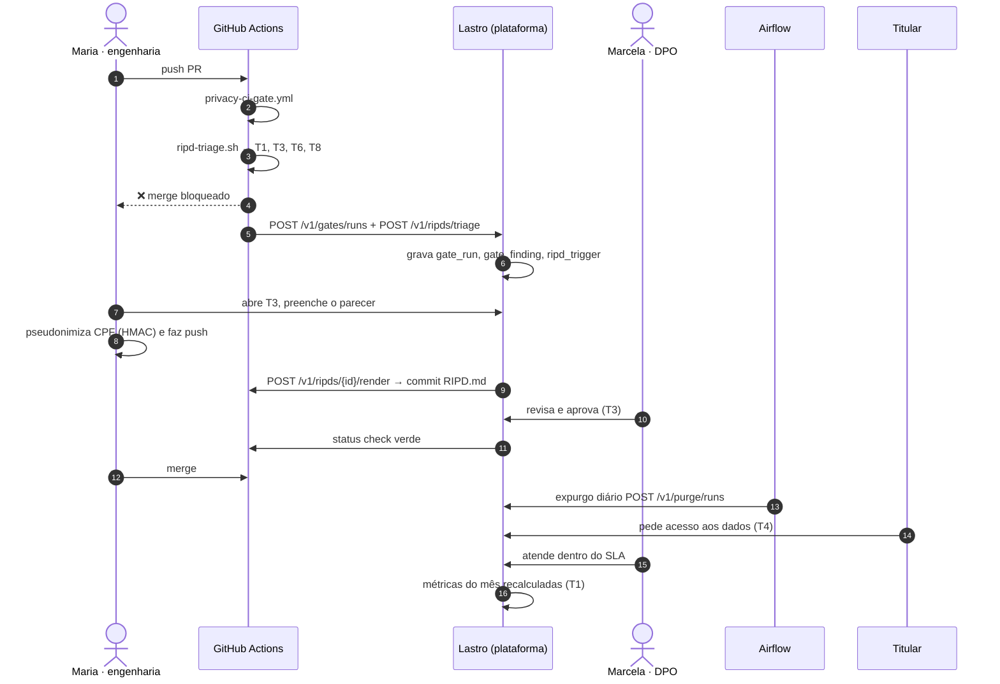
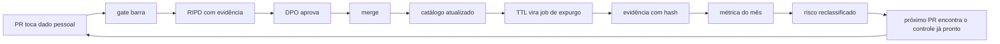

# Fluxo ponta a ponta — do pull request ao expurgo

Um cenário completo, com os artefatos, telas, endpoints e tabelas envolvidos em cada passo.
É o mesmo caso que povoa o protótipo e o `db/seed.sql`.

---

## O caso

A squad de crédito quer usar um LLM externo para melhorar o scoring. O primeiro commit interpola o
CPF direto no prompt.



---

## Passo a passo

### 1 · O dev abre o PR

```python
# src/models/credit_model.py  (versão que entrou no PR)
prompt = f"""
Analise o crédito do cliente:
Nome: {cliente['nome']}
CPF: {cliente['cpf']}
Renda: R$ {cliente['renda']}
"""
```

### 2 · O gate roda e barra

`privacy-ci-gate.yml` encontra CPF em caminho de log e um campo novo sem base legal.
`ripd-triage.sh` classifica o diff e devolve `ripd-report.json`:

| Trigger | Categoria | Crítico | Evidência |
|---|---|---|---|
| T1 | dado sensível | ✅ | CPF interpolado no prompt (`credit_model.py:38`) |
| T3 | decisão automatizada | ✅ | `/creditos/avaliar` retorna aprovado/reprovado |
| T6 | nova tecnologia | ⚠️ | dependência `openai`, modelo `gpt-4o` |
| T8 | transferência internacional | ⚠️ | processamento em `us-east-1` |

Dois críticos ⇒ `bloquear_merge: true` ⇒ o job sai com código 1.

O workflow posta em `POST /v1/gates/runs` e `POST /v1/ripds/triage`. A plataforma grava `gate_run`,
`gate_finding` (com a mensagem traduzida) e `ripd_trigger`, e abre o `RIPD-2026-014` em rascunho.

> **Onde isso aparece:** T1, cartão "PRs bloqueados" e a tabela "O que a esteira barrou" — com a
> mensagem em português e o passo de correção, não com o `exit code 1`.

### 3 · A engenharia preenche o RIPD (T3)

A seção 2 vem do catálogo por seleção múltipla: `cpf`, `renda`, `score_serasa`, `historico_compras`.
Ao marcar `historico_compras` como legítimo interesse, a plataforma exige uma LIA vigente — se não
houver, o campo é recusado (`campo_exige_lia_vigente`). É o gancho que leva a T8.

O checklist LINDDUN gera as mitigações. Cada uma vira recomendação com dono e prazo:

| | Recomendação | Dono | Prazo |
|---|---|---|---|
| P0 | Pseudonimizar CPF antes do LLM | @eng-maria | 04/08 |
| P0 | Endpoint de revisão de decisão | @eng-maria | 11/08 |
| P0 | Assinar SCC com a OpenAI | @juridico-ana | 04/08 |
| P1 | Teste de disparate impact no CI | @ml-joao | 18/08 |

### 4 · A correção entra no código

```typescript
// src/utils/pseudonymizer.ts
const cpfToken = await pseudonymizeCPF(cliente.cpf, 'scoring');
const prompt = `Analise o crédito do cliente ${cpfToken} …`;
```

Novo push, gate roda de novo: a regra `pii_em_log` passa. O bloqueio remanescente é o de arquitetura,
que só cai com aprovação do DPO.

### 5 · O DPO aprova (T3)

`POST /v1/ripds/RIPD-2026-014/approve` grava `ripd_aprovacao` com o hash do documento e o `sub` do
aprovador, e a plataforma reposta o status check no GitHub. O `RIPD.md` renderizado do
`parecer-tecnico.md` é commitado no próprio PR.

Uma linha entra no `audit_log` — e sela a anterior.

### 6 · Merge

O merge libera porque **todos** os checks estão verdes. A plataforma não é a fila de merge: ela
aprova, o GitHub decide (ADR-2).

### 7 · O job de expurgo roda (T6)

Às 03:00 o `expurgo-permanente.py` percorre as tabelas com TTL vencido:

| Tabela | Método | Registros | hash pré | hash pós |
|---|---|---|---|---|
| `decisoes_ia` | hard delete | 8.120 | `a3f19c2b…` | `7e9f1a3b…` |
| `historico_compras` | cripto-shredding | 6.301 | `b5c7d9e1…` | `1e3f5a7b…` |
| `biometria_facial` | cripto-shredding | 411 | `d7e9f1a3…` | `3a5b7c9d…` |

`POST /v1/purge/runs` registra tudo. A segurança clica em "Verificar integridade" e a função
`verificar_integridade_audit` recalcula a cadeia inteira.

### 8 · Um titular exerce um direito (T4)

Ana pede acesso aos dados. Protocolo `2026-0731`, prazo de 15 dias úteis, cronômetro visível.
Para confirmar identidade, a DPO clica em "revelar" no CPF:

1. modal exige **finalidade** (`atendimento`) e **justificativa**;
2. a tentativa entra no `audit_log` **antes** da resolução;
3. `POST /v1/pseudonyms/resolve` chega ao serviço do produto, que chama o KMS com `EncryptionContext={purpose}`;
4. o valor aparece por 60 s e volta a mascarar sozinho;
5. o log registra os campos efetivamente retornados.

A aba "Compartilhamentos" responde ao Art. 18, VII a partir da tabela `linhagem` — OpenAI, Serasa,
SendGrid, com finalidade, base legal e mecanismo de transferência.

### 9 · A métrica se move (T1)

O `metrics-collector.py` publica o snapshot do dia:

| Métrica | Antes | Depois |
|---|---|---|
| % serviços com log sem PII | 88% | **92%** |
| % datasets com base legal | 89,8% | **94,3%** |
| RIPD pendentes | 6 | **3** |
| SLA médio de titulares | 41,5 h | **34 h** |

O risco R1 sai de score 20 para risco residual 5 — reclassificação registrada em
`risco_reclassificacao`, com justificativa, e reavaliação agendada para 90 dias.

---

## O ciclo se fecha



A propriedade que importa: **nenhum passo depende de alguém lembrar**. A triagem é automática, o
bloqueio é automático, o expurgo é automático, a evidência é automática. O que exige julgamento
humano — aprovar o RIPD, assinar a LIA, reverter uma decisão automatizada — é exatamente o que fica
com nome, justificativa e assinatura.

---

## Onde o fluxo pode falhar (e o que a plataforma faz)

| Falha | Sintoma | Resposta do sistema |
|---|---|---|
| Dev contorna o gate com `[skip ci]` | Nenhum `gate_run` para o `head_sha` | T1 lista PRs mergeados sem gate; o branch protection exige o check |
| RIPD aprovado e depois o código muda | `head_sha` diverge do aprovado | Aprovação é vinculada ao SHA; novo push reabre o bloqueio |
| LIA vence sem renovação | `lia.status = 'vencida'` | Campo perde base legal, gate volta a bloquear o repositório, aviso 60 dias antes |
| Job de expurgo falha | `expurgo_run.status = 'falhou'` | Dia marcado em vermelho no calendário da T6; reexecução é idempotente pelo par de hashes |
| Alguém adultera o audit trail | `hash` divergente | "Verificar integridade" acusa a linha e todas as seguintes |
| Titular não recebe resposta no prazo | `v_sla_titular.estourado` | Notificação ao DPO a menos de 24 h; a métrica do mês registra o descumprimento |
